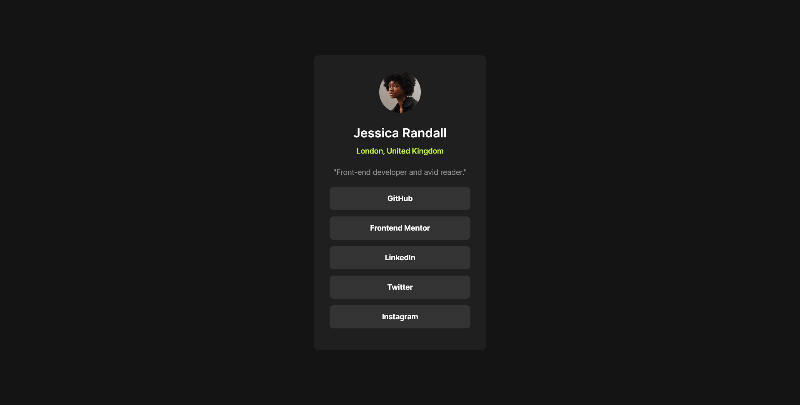

# Frontend Mentor - Social links profile solution

This is a solution to the [Social links profile challenge on Frontend Mentor](https://www.frontendmentor.io/challenges/social-links-profile-UG32l9m6dQ). Frontend Mentor challenges help you improve your coding skills by building realistic projects.

## Table of contents

- [Overview](#overview)
  - [The challenge](#the-challenge)
  - [Screenshot](#screenshot)
  - [Links](#links)
- [My process](#my-process)
  - [Built with](#built-with)
  - [What I learned](#what-i-learned)
- [Author](#author)
- [Acknowledgments](#acknowledgments)

## Overview

### The challenge

This is my third project. I love it. This project is similar to previous two projects I did.

### Screenshot



### Links

- Solution URL: [Add solution URL here](https://github.com/MgMyatHtayKhant/social-links-profile-main)
- Live Site URL: [Add live site URL here](https://frontend-social-links.netlify.app/)

## My process

### Built with

- Semantic HTML5 markup
- CSS custom properties
- Flexbox

### What I learned

I learned how to use links with unorderlist. It so much each to style it.

```html
<ul class="card-social-media-links">
  <li><a href="https://github.com/">GitHub</a></li>
  <li><a href="https://www.frontendmentor.io/">Frontend Mentor</a></li>
  <li><a href="https://www.linkedin.com/">LinkedIn</a></li>
  <li><a href="https://x.com/?lang=en">Twitter</a></li>
  <li><a href="https://www.instagram.com/">Instagram</a></li>
</ul>
```

## Author

- Website - [Saul](https://saul-homepage.netlify.app/)
- Frontend Mentor - [@yourusername](https://www.frontendmentor.io/profile/yourusername)

## Acknowledgments

This project is done by myslef and I'm proud of it.
